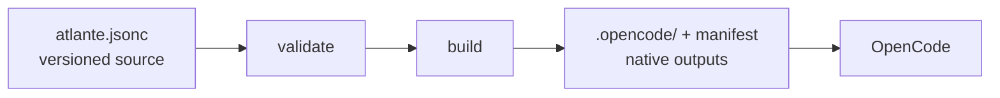

<p align="center">
  
</p>

<p align="center">The configuration layer for your coding-agent harness.</p>

Atlante gives developers a versioned, structured, and composable source for
their agents and skills. It validates and composes that source, creates the
files their host discovers, and provides `atlante eval` to test the resulting
harness, so it can be developed like code.

[OpenCode](https://opencode.ai/) is the only supported host today. Read the
[documentation](https://docs.atlante.sh) for concepts, guides, and reference.

## Quick start

Requires [Node.js](https://nodejs.org) 22 or newer. Run the CLI from the
project you want to configure:

```bash
npx @atlante/cli@latest init            # scaffold atlante.jsonc and build the first outputs
npx @atlante/cli@latest validate        # check the configuration without building
npx @atlante/cli@latest build           # materialize the native outputs
npx @atlante/cli@latest build --watch   # rebuild while you edit
npx @atlante/cli@latest eval            # optional: run eval scenarios in a sandbox
```

`init` writes `atlante.jsonc`, materializes the first native outputs, and adds
the generated folders to `.gitignore`. To use the bare `atlante` command,
install the CLI first:

```bash
npm install --global @atlante/cli
atlante init
```

After a build, OpenCode discovers the generated agents and skills when it
starts; restart it to pick up new or changed files.

## How it works



The authored source stays in your repository, so the harness is reviewed and
evolved like any other code. The build materializes deterministic
host-native files; the host executes them.

## A first configuration

```jsonc
{
  "$schema": "https://atlante.sh/schema/v0.1/schema.json",
  "extends": "@atlante/pack",
  "values": {
    "project": "my-app",
    "apiRule": "All public APIs must have JSDoc."
  },
  "agents": {
    "implementer": {
      "$template": "@atlante/pack/agent",
      "description": "Implements requested changes in the project.",
      "identity": "You are a senior implementer on {{values.project}}.",
      "mission": "Write clean, tested, production-ready code.",
      "sections": [
        {
          "responsibilities": [
            "Implement features following the spec",
            "Write unit and integration tests",
          ],
        },
        {
          "invariants": ["{{values.apiRule}}"],
        },
      ],
    },
  },
}
```

- `extends` selects a preset to build on; local configuration wins over what it inherits.
- `$template` binds an agent or skill to a template; the template's schema defines the remaining fields.
- `values` defines named inputs referenced as `{{values.project}}`.

## Boundary

Atlante validates, renders, and materializes files. It does not execute agents
or skills, perform LLM inference, run project code, or own host settings —
models, permissions, and tools remain owned by OpenCode. The optional
`atlante eval` command uses OpenCode to run those scenarios in a sandbox and
check the results.

## Packages

Atlante publishes two packages to npm: [`@atlante/cli`](https://www.npmjs.com/package/@atlante/cli)
(`init`, `validate`, `build`, `eval`) and [`@atlante/pack`](https://www.npmjs.com/package/@atlante/pack)
(the first-party presets, templates, and instances). To publish your own
reusable content, read [Author a pack](https://docs.atlante.sh/guides/authoring-packs).

## Documentation

- [Getting started](https://docs.atlante.sh/getting-started)
- Concepts: [Configuration](https://docs.atlante.sh/concepts/configuration), [Templates](https://docs.atlante.sh/concepts/templates), [Values](https://docs.atlante.sh/concepts/values), [Resources](https://docs.atlante.sh/concepts/resources), [Native outputs](https://docs.atlante.sh/concepts/native-outputs)
- Guides: [Build a harness](https://docs.atlante.sh/guides/building-a-harness), [Use OpenCode](https://docs.atlante.sh/guides/opencode), [Author a pack](https://docs.atlante.sh/guides/authoring-packs)
- Reference: [CLI](https://docs.atlante.sh/reference/cli), [Schema](https://docs.atlante.sh/reference/schema), [Materialization](https://docs.atlante.sh/reference/materialization), [Diagnostics](https://docs.atlante.sh/reference/diagnostics)
- [Troubleshooting](https://docs.atlante.sh/troubleshooting)

## Status

The current alpha `v0.1` follows the [`SPECIFICATION.md`](SPECIFICATION.md) as
the normative technical contract.

## License

See [LICENSE](LICENSE).
