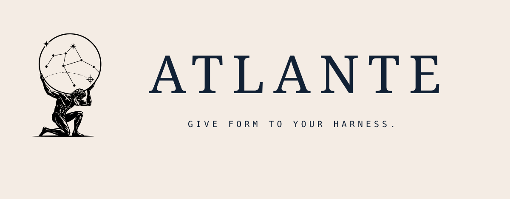
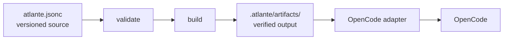

<p align="center">
  
</p>

<p align="center">The configuration layer for your coding-agent harness.</p>

Atlante gives software architects, engineers, and developers one versioned source for the agents, skills, and workflows that make up their coding-agent harness. It makes those relationships explicit in the repository so individuals and teams can share, review, and evolve the system through Git.

The builder validates the authored configuration, composes selected templates, instances, and presets, and publishes deterministic artifacts. A host adapter materializes those artifacts for the host.

OpenCode is the only supported host adapter today.

## Why Atlante

- **Structure:** define agents, skills, workflows, values, and their relationships in one configuration.
- **Shared source:** keep the harness with project code and review changes through Git.
- **Composition:** inherit presets and compose template and instance facets instead of duplicating prompts.
- **Validation:** check document structure and template inputs before building artifacts.
- **Deterministic output:** render prompts and skills into verified artifact files.
- **Clear boundary:** Atlante defines prompt-level orchestration; OpenCode and the prompted model execute it.

## Quick start

The CLI requires Node.js 22 or newer. Run the published package directly with `npx`:

```bash
npx @atlante/cli init
npx @atlante/cli validate
npx @atlante/cli build
```

`init` writes `atlante.jsonc`, builds the initial `.atlante/artifacts/` tree, and registers `@atlante/opencode-plugin` in `opencode.jsonc` while preserving existing host settings. Edit the authored configuration, then run `npx @atlante/cli build` again, or use `npx @atlante/cli build --watch` during active editing.

To use the bare `atlante` command, install the CLI first:

```bash
npm install --global @atlante/cli
atlante init
```

`--force` replaces an existing `atlante.jsonc` and removes the alternate `atlante.json`.

## A quick-start demonstration



The authored source stays in the project repository. The builder publishes the artifact tree, and the OpenCode adapter verifies it before materializing prompts and skills in memory.

## Configuration

An `atlante.jsonc` can extend the first-party preset and bind an agent template:

```jsonc
{
  "$schema": "https://atlante.sh/schema/v0.1/schema.json",
  "extends": "@atlante/pack",
  "values": {
    "project": "my-app",
    "apiRule": "All public APIs must have JSDoc."
  },
  "agents": {
    "implementer": {
      "$template": "@atlante/pack/agent",
      "description": "Implements requested changes in the project.",
      "identity": "You are a senior implementer on {{values.project}}.",
      "mission": "Write clean, tested, production-ready code.",
      "sections": [
        {
          "responsibilities": [
            "Implement features following the spec",
            "Write unit and integration tests",
          ],
        },
        {
          "invariants": ["{{values.apiRule}}"],
        },
      ],
    },

    "reviewer": {
      "$template": "@atlante/pack/agent",
      "description": "Reviews changes for defects and design issues.",
      "identity": "You are a thorough code reviewer on {{values.project}}.",
      "mission": "Ensure code quality and adherence to standards.",
      "sections": [
        {
          "responsibilities": [
            "Review implementations for bugs and design issues",
            "Check that project invariants remain satisfied.",
          ],
        },
        {
          "invariants": ["{{values.apiRule}}"],
        },
      ],
    },
  },
}
```

The root document supports `$schema`, `extends`, `values`, `agents`, and optional `skills` fields. Templates define their own input schemas.
Values are substituted into the prompt definition before rendering; templates do not receive the values dictionary directly.
The first-party `@atlante/pack/agent` template also accepts ordered `sections`, including workflow sections with phases, delegation, outputs, validation, and correction policies.

Skills are structured template input rendered as Markdown, not agents. A
resolved skill is available to every host agent through the OpenCode plugin
and the `atlante_skill` tool. Atlante does not execute skill content.

## Safety properties

- Values are substituted into prompt definitions before template rendering; they are never evaluated as code.
- Unsupported values-like references are diagnosed, while other brace syntax such as `{{#each}}`, `{{#if}}`, and unbalanced `{{` is preserved verbatim.
- OpenCode consumes only the verified `.atlante/artifacts/` tree. Each payload is protected by a manifest SHA-256 digest, and adapters reject malformed trees or digest mismatches before materialization.

## How it works

1. You write `atlante.jsonc` with agent and optional skill bindings and values.
2. Packs provide templates, instances, presets, and their input schemas.
3. The builder resolves presets and values, validates inputs, renders prompts and skills, and publishes artifacts.
4. The host adapter verifies the artifacts and delivers the rendered content to the host.

For OpenCode, the plugin loads only the verified `.atlante/artifacts/` tree. It writes the rendered agent `prompt` and `description` fields during initialization. Models, permissions, tools, and modes remain owned by OpenCode.

## Packs and presets

A pack is a static Atlante content package. It can contain presets, template facets, and instance facets, but it has no JavaScript entry point, registration hook, or executable API.

`@atlante/pack` is the first-party pack. `atlante init` uses its default preset unless you provide another preset locator:

```bash
npm install --save-dev @acme/review-pack
npx @atlante/cli init --preset @acme/review-pack
npx @atlante/cli init --preset @acme/review-pack/strict
```

Use an ordered `extends` array when a configuration needs multiple preset layers. Local configuration wins after the selected layers are merged.

## Migration from the temporary namespace

This is an alpha breaking migration. Replace the old built-in locators as follows:

| Before | After |
| --- | --- |
| `atlante/starter` | `@atlante/pack` |
| `atlante/<resource>` | `@atlante/pack/<resource>` |

Do not add `@atlante/resources` as a project dependency. Install third-party
packs with the package manager and declare them in `dependencies`,
`devDependencies`, or `optionalDependencies`; Atlante never edits
`package.json` or installs packages.

## Current scope

Atlante v0.1 includes:

- **Configuration:** declarative JSONC or JSON documents with composable templates.
- **Values:** global values with per-agent overrides.
- **Skills:** project-global Markdown skills through the `atlante_skill` adapter tool.
- **Validation:** structural and template-input validation.
- **Artifacts:** deterministic prompt resolution and artifact publication.
- **Packs:** local templates and instances, plus installed static packs.
- **OpenCode:** prompt and skill materialization.

Atlante does not perform LLM inference, execute agents or skills, run arbitrary project code while loading a pack, select host settings, maintain runtime workflow state, or provide another host in v0.1.

## Packages

Three packages are published to npm:

| Package | Responsibility |
| --- | --- |
| `@atlante/pack` | First-party static presets, templates, and instances |
| `@atlante/cli` | `init`, `validate`, and `build` |
| `@atlante/opencode-plugin` | In-memory agent injection and `atlante_skill` through OpenCode |

The remaining workspaces are private implementation packages for the schema, resource loading, validation, and artifact builder.

## Repository assets

The production artwork is derived from `public/assets/final_logo.svg`. The repository includes the named lockups, glyphs, social preview, and favicon exports under [`public/assets/exports`](public/assets/exports). The export package records dimensions, provenance, clear space, reproduction rules, and font references.

The framework-neutral token source is [`public/atlante-design-tokens.css`](public/atlante-design-tokens.css). Bundled font files and their SIL Open Font License notices are documented in [`public/fonts/README.md`](public/fonts/README.md).

## Development

```bash
bun install
bun run lint:check
bun run type:check
bun run test
```

The repository uses Bun for package management and build commands. Tests run through Vitest on Node.js 22.

Run the CLI directly from source with `bun run cli <command>`:

```bash
bun run cli init
bun run cli validate
bun run cli build
```

Run `bun run build` after CLI source changes. The linked `atlante` command uses the built CLI artifact.

## Status

v0.1, prompt-first profile. See [`SPECIFICATION.md`](SPECIFICATION.md) for the normative technical contract.
