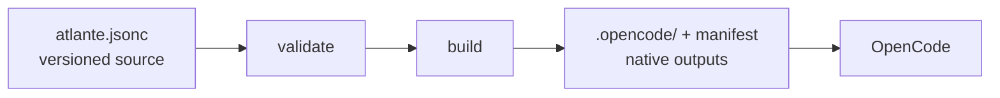

<p align="center">
  
</p>

<p align="center">The configuration layer for your coding-agent harness.</p>

Atlante gives software architects, engineers, and developers one versioned source for the agents, skills, and workflows that make up their coding-agent harness. It makes those relationships explicit in the repository so individuals and teams can share, review, and evolve the system through a versioning system (e.g., Git).

The builder validates the authored configuration, composes selected templates, instances, and presets, and renders a prepared project in memory. A host materializer then writes that prepared project as host-native files the host discovers directly.

[OpenCode](https://opencode.ai/) is the only supported host today.
Read the [documentation](https://docs.atlante.sh) for installation, concepts,
configuration, CLI reference, and OpenCode integration.

## Why Atlante

- **Structure:** define agents, skills, workflows, values, and their relationships in one configuration.
- **Shared source:** keep the harness with project code and review changes through a versioning system.
- **Composition:** inherit presets and compose templates and instances instead of duplicating prompts.
- **Validation:** check document structure and template inputs before building.
- **Deterministic output:** render prompts and skills into deterministic host-native files.
- **Clear boundary:** Atlante defines prompt-level orchestration; OpenCode and the prompted model execute it.

## Flow



The authored source stays in the project repository. The build materializes prompts and skills as host-native files, and OpenCode discovers them when it starts.

## Features

Atlante v0.1 includes:

- **Configuration:** declarative JSONC or JSON documents with composable templates.
- **Values:** global values with per-agent overrides.
- **Skills:** project-global Markdown skills materialized as native skill files.
- **Validation:** structural and template-input validation.
- **Native outputs:** deterministic rendering and host-native materialization.
- **Packs:** local templates and instances, plus installed static packs.
- **OpenCode:** prompt and skill materialization.

Atlante does not perform LLM inference, execute agents or skills, run arbitrary
project code while loading a pack, select host settings, or maintain runtime
workflow state. The optional `atlante eval` command delegates a scenario run to
OpenCode in a temporary sandbox; Atlante does not provide another host in v0.1.

## Packages

Two packages are published to npm:

| Package | Responsibility |
| --- | --- |
| `@atlante/pack` | First-party static presets, templates, and instances |
| `@atlante/cli` | `init`, `validate`, `build`, and `eval` |

The OpenCode materializer is an internal workspace bundled into the CLI. The
remaining workspaces are private implementation packages for the schema,
resource loading, validation, build orchestration, and eval orchestration.

## Development

```bash
bun install
bun run lint:check
bun run type:check
bun run test
```

The repository uses Bun for package management, build commands, and tests (bun:test).

Run the CLI directly from source with `bun run cli <command>`:

```bash
bun run cli init
bun run cli validate
bun run cli build
bun run cli eval
```

Run `bun run build` after CLI source changes. The linked `atlante` command uses the built CLI artifact.

## Quick start

The CLI requires [Node.js](https://nodejs.org) 22 or newer. Run the published package directly with `npx`:

```bash
npx @atlante/cli@latest init
npx @atlante/cli@latest validate
npx @atlante/cli@latest build
npx @atlante/cli@latest eval
```

`init` writes `atlante.jsonc`, materializes the first native outputs, adds
`.opencode/agents/`, `.opencode/skills/`, and `.atlante/` to `.gitignore`, and
removes an Atlante-written `@atlante/opencode` plugin registration from
`opencode.jsonc` (or an existing `opencode.json`). Existing host settings are
preserved.

You can edit the authored configuration and then run `npx @atlante/cli@latest build` again, or use `npx @atlante/cli@latest build --watch` during active editing.

To use the bare `atlante` command, install the CLI first:

```bash
npm install --global @atlante/cli
atlante init
```

`--force` replaces an existing `atlante.jsonc` and removes the alternate `atlante.json`.

## Configuration

An `atlante.jsonc` can extend the first-party preset and bind an agent template:

```jsonc
{
  "$schema": "https://atlante.sh/schema/v0.1/schema.json",
  "extends": "@atlante/pack",
  "values": {
    "project": "my-app",
    "apiRule": "All public APIs must have JSDoc."
  },
  "agents": {
    "implementer": {
      "$template": "@atlante/pack/agent",
      "description": "Implements requested changes in the project.",
      "identity": "You are a senior implementer on {{values.project}}.",
      "mission": "Write clean, tested, production-ready code.",
      "sections": [
        {
          "responsibilities": [
            "Implement features following the spec",
            "Write unit and integration tests",
          ],
        },
        {
          "invariants": ["{{values.apiRule}}"],
        },
      ],
    },

    "reviewer": {
      "$template": "@atlante/pack/agent",
      "description": "Reviews changes for defects and design issues.",
      "identity": "You are a thorough code reviewer on {{values.project}}.",
      "mission": "Ensure code quality and adherence to standards.",
      "sections": [
        {
          "responsibilities": [
            "Review implementations for bugs and design issues",
            "Check that project invariants remain satisfied.",
          ],
        },
        {
          "invariants": ["{{values.apiRule}}"],
        },
      ],
    },
  },
}
```

### Document structure

An `atlante.jsonc` document can contain these top-level fields:

- `$schema` identifies the schema used to validate the document.
- `extends` selects one or more presets to build on.
- `values` defines named values that can be reused across the document.
- `agents` declares the agents that Atlante should render.
- `skills` optionally declares reusable Markdown skills.

The document defines the overall structure. Each selected template defines the input schema for its own binding, so template-specific fields stay separate from the document contract.

### Values and templates

Values are named inputs shared by the document, such as `{{values.project}}`. During a build, Atlante substitutes those references into the prompt definition before rendering it. A template receives only the inputs declared by its own schema; it does not receive the complete values object. This keeps templates explicit about the data they use.

### Agent sections

The first-party `@atlante/pack/agent` and `@atlante/pack/skill` templates
support an ordered `sections` array. Common section variants include `markdown`,
`instructions`, `responsibilities`, `gotchas`, `workflow`, and `invariants`.
The skill template also supports `references`, which renders named entries with
optional guidance about when to read them. Each section contributes a distinct
part of the rendered output, and the order in the array is preserved.
Responsibilities name owned outcomes, instructions describe ordered actions, and
invariants are binding guarantees and approval gates; keep invariants minimal,
concrete, and observable.

This lets the same agent template produce different agents without duplicating the template itself.

### Skills

Skills are reusable guidance, not agents. A skill uses structured template input and is rendered as Markdown. After a build, each skill is materialized as `.opencode/skills/<skillId>/SKILL.md`, which OpenCode discovers like any native skill. Atlante provides the rendered content but does not execute the skill.

For OpenCode, the build writes `.opencode/agents/<id>.md` with the rendered agent prompt and description, plus the `.atlante/opencode-native.json` ownership manifest. Models, permissions, tools, and modes remain owned by OpenCode. Restart OpenCode to pick up new or changed native files.

Atlante validates, renders, and materializes deterministic host-native files; the
optional `atlante eval` command delegates sandbox execution to OpenCode rather
than executing agents or project code during normal artifact processing.

### Packs and presets

A pack is static Atlante content. It can contain presets, templates, and instances, but it has no JavaScript entry point, registration hook, or executable API.

`@atlante/pack` is the first-party pack. `atlante init` uses its default preset unless you select another pack with `--pack`:

```bash
npx @atlante/cli@latest init --pack @acme/review-pack
npx @atlante/cli@latest init --pack @acme/review-pack/strict
```

`--pack` installs the pack with the project's package manager (detected from the
lockfile) and declares it in `devDependencies`, unless it is already declared.
Selecting a pack without a preset picks its only preset automatically and
prompts when it provides several; in non-interactive terminals, pass the preset
explicitly as `<pack>/<preset>`. Initialization is transactional: a failure
restores the configuration files, `package.json`, and the lockfile, and — when
the pack was newly added — reconciles `node_modules`.

Use an ordered `extends` array when a configuration needs multiple preset layers. Local configuration wins after the selected layers are merged.

## Status

The current alpha `v0.1` follows the [`SPECIFICATION.md`](SPECIFICATION.md) as the normative technical contract.

## License

See [LICENSE](LICENSE).
