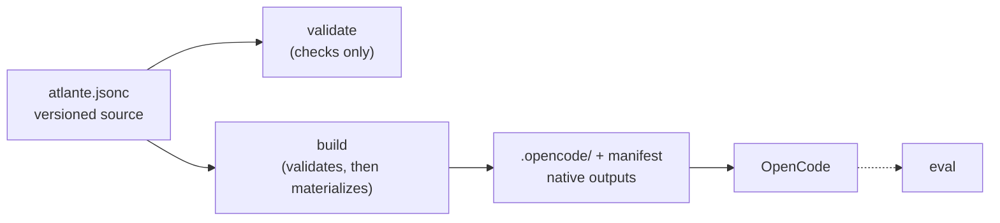

<p align="center">
  
</p>

<p align="center">The configuration layer for your coding-agent harness.</p>

Atlante gives developers a versioned, structured, and composable source for
their agents and skills. It validates and composes that source, creates the
files their host discovers, and provides `atlante eval` to test the resulting
harness, so it can be developed like code.

> [!NOTE]
> [OpenCode](https://opencode.ai/) is the only supported host today. Read the
> [documentation](https://docs.atlante.sh) for concepts, guides, and reference.

## Scope

| Atlante does | Atlante doesn't |
| --- | --- |
| Validates and composes a versioned JSONC source for agents and skills | Executes agents or skills, or performs LLM inference |
| Renders deterministic prompt and skill content | Runs your project code |
| Materializes host-native files, guarded by an ownership manifest | Owns host settings — models, permissions, and tools remain with OpenCode |
| Tests the harness with `atlante eval`, delegated to the host in a sandbox | Manages runtime workflow state, checkpoints, or scheduling |

## Quick start

Run the CLI from the project you want to configure:

```bash
npx @atlante/cli@latest init            # scaffold atlante.jsonc and build the first outputs
npx @atlante/cli@latest validate        # check the configuration without building
npx @atlante/cli@latest build           # materialize the native outputs
npx @atlante/cli@latest build --watch   # rebuild while you edit
npx @atlante/cli@latest eval            # optional: run eval scenarios in a sandbox
```

> [!NOTE]
> Requires [Node.js](https://nodejs.org) 22 or newer.

`init` writes `atlante.jsonc` extending the bundled first-party
[`@atlante/pack`](https://www.npmjs.com/package/@atlante/pack) preset; no other
pack is installed or selected. Pass `--pack <locator>` to start from a
different pack instead. It also materializes the first native outputs and adds
the generated folders to `.gitignore`. To use the bare `atlante` command,
install the CLI first:

```bash
npm install --global @atlante/cli
atlante init
```

After a build, OpenCode discovers the generated agents and skills when it
starts; restart it to pick up new or changed files.

## How it works

1. **Author** `atlante.jsonc`: extend a preset, bind agents and skills to
   templates, and define values.
2. **Validate** checks the source, selected resources, and template input
   without writing anything.
3. **Build** runs the same validation first, then renders deterministic
   host-native files plus an ownership manifest; on any failure it writes
   nothing.
4. **Discover**: the host reads the generated agents and skills when it
   starts.
5. **Evaluate** (optional): `atlante eval` runs scenarios in a sandbox and
   grades deterministic checks.



The authored source stays in your repository, so you review and evolve the
harness like any other code. The build materializes deterministic
host-native files; the host executes them.

## A first configuration

```jsonc
{
  "$schema": "https://atlante.sh/schema/v0.1/schema.json",
  // The first-party preset: the general-purpose architect agent and the
  // workflow skills (brainstorm, plan, build, review, harness).
  "extends": "@atlante/pack",
  "values": {
    "project": "my-app",
    // Referenced below as {{values.apiRule}}.
    "apiRule": "All public APIs must have JSDoc.",
  },
  "agents": {
    // A project-specific agent: the preset already provides the
    // general-purpose architect, so add the roles your project needs.
    "api-designer": {
      "$template": "@atlante/pack/agent",
      "description": "Designs and reviews the public API surface of {{values.project}}.",
      "identity": "You are the API designer for {{values.project}}.",
      "mission": "Keep the public API small, consistent, and backward-compatible.",
      "sections": [
        {
          "responsibilities": [
            "Design new endpoints and their request and response contracts",
            "Review breaking changes before they merge",
          ],
        },
        {
          "invariants": ["{{values.apiRule}}"],
        },
      ],
    },
  },
  // Test the harness with deterministic scenarios run in a sandbox.
  "eval": {
    "host": "opencode",
    "scenarios": "eval/scenarios/*.eval.json",
  },
}
```

- `extends` selects a preset to build on; local configuration wins over what
  it inherits.
- `$template` binds an agent or skill to a template; the template's schema
  defines the remaining fields.

When configuration grows, move it into a local pack: a folder in your
repository holding a preset and its resources, referenced through `extends`
like any other pack. The
[Author a pack](https://docs.atlante.sh/guides/authoring-packs) guide covers
the layout.

## Test the harness

`atlante eval` runs scenarios in a sandbox against the built outputs and
grades deterministic checks; the checks themselves never call a model. A
scenario that exercises the agent above:

```json
{
  "$schema": "https://atlante.sh/schema/v0.1/eval-scenario.json",
  "version": "0.1",
  "name": "designs-health-endpoint",
  "task": {
    "fixture": "eval/fixtures/empty-app",
    "agent": "api-designer",
    "prompt": "Design a GET /health endpoint that returns { \"status\": \"ok\" }."
  },
  "checks": [
    {
      "type": "file-contains",
      "path": "src/routes.ts",
      "pattern": "\"status\": \"ok\""
    },
    {
      "type": "diff-allowlist",
      "allow": ["src/routes.ts", "src/health.test.ts"]
    }
  ]
}
```

Each trial runs the prompt in a fresh sandbox seeded with the fixture, and a
trial counts only when every check passes.

## Packages

Atlante publishes two packages to npm:

- [`@atlante/cli`](https://www.npmjs.com/package/@atlante/cli) — the `init`,
  `validate`, `build`, and `eval` commands.
- [`@atlante/pack`](https://www.npmjs.com/package/@atlante/pack) — the
  first-party presets, the `agent` and `skill` templates, and their
  instances.

To publish your own reusable content, read
[Author a pack](https://docs.atlante.sh/guides/authoring-packs).

## Documentation

- [Getting started](https://docs.atlante.sh/getting-started)
- Concepts: [Configuration](https://docs.atlante.sh/concepts/configuration), [Templates](https://docs.atlante.sh/concepts/templates), [Values](https://docs.atlante.sh/concepts/values), [Resources](https://docs.atlante.sh/concepts/resources)
- Guides: [Build a harness](https://docs.atlante.sh/guides/building-a-harness), [Author a pack](https://docs.atlante.sh/guides/authoring-packs)
- Reference: [CLI](https://docs.atlante.sh/reference/cli), [Eval](https://docs.atlante.sh/reference/eval), [Template syntax](https://docs.atlante.sh/reference/template-syntax), [Schema](https://docs.atlante.sh/reference/schema), [Materialization](https://docs.atlante.sh/reference/materialization), [Diagnostics](https://docs.atlante.sh/reference/diagnostics)
- [Troubleshooting](https://docs.atlante.sh/troubleshooting)

## Status

The current alpha `v0.1` follows the [`SPECIFICATION.md`](SPECIFICATION.md) as
the normative technical contract.

## License

See [LICENSE](LICENSE).
