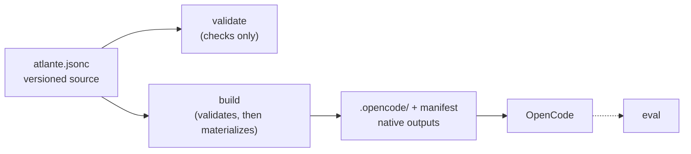

<p align="center">
  
</p>

<p align="center">The configuration layer for your coding-agent harness.</p>

Atlante gives developers a versioned, structured, and composable source for
their agents and skills. It validates and composes that source, creates the
files their host discovers, and provides `atlante eval` to test the resulting
harness, so it can be developed like code.

> [!NOTE]
> [OpenCode](https://opencode.ai/) is the only supported host today. Read the
> [documentation](https://docs.atlante.sh) for concepts, guides, and reference.

## Quick start

Run the CLI from the project you want to configure:

```bash
npx atlante@latest init            # scaffold atlante.jsonc and build the first outputs
npx atlante@latest init --no-mcp   # scaffold without registering the MCP server
npx atlante@latest pack install @acme/review-pack
npx atlante@latest pack list       # inspect direct pack dependencies
npx atlante@latest pack uninstall @acme/review-pack
npx atlante@latest validate        # check the configuration without building
npx atlante@latest build           # materialize the native outputs
npx atlante@latest build --watch   # rebuild while you edit
npx atlante@latest mcp             # start the read-only MCP server over stdio
npx atlante@latest import agent.md --kind agent --out ./my-pack
npx atlante@latest eval            # optional: run eval scenarios in a sandbox
```

> [!NOTE]
> Requires [Node.js](https://nodejs.org) 22 or newer.

`init` writes `atlante.jsonc` extending the bundled first-party
[`@atlante/pack`](https://www.npmjs.com/package/@atlante/pack) preset; no other
pack is installed or selected. Pass `--pack <locator>` to start from a
different pack instead. It also materializes the first native outputs and adds
the generated folders to `.gitignore`. By default, it also registers the
version-pinned, read-only Atlante MCP server in the first existing OpenCode
configuration under `.opencode/` or the project root; when none exists, it
creates root `opencode.jsonc`. Pass `--no-mcp` to
leave OpenCode configuration unchanged. To use the bare `atlante` command,
install the CLI first:

```bash
npm install --global atlante
atlante init
```

Use `atlante pack install`, `atlante pack uninstall`, and `atlante pack list` to
manage third-party pack dependencies independently of initialization. Pack
installation uses the project's package manager, validates the installed pack,
and rolls back dependency changes when validation fails. These commands do not
change the configuration or generated outputs; the bundled `@atlante/pack` does
not need to be installed as a project dependency.

Use `atlante import` to convert an existing Markdown agent or skill into a
project-local pack. Pass `--kind agent` or `--kind skill` and `--out <dir>`; see
the [CLI reference](https://docs.atlante.sh/reference/cli#atlante-import) for
the supported Markdown and frontmatter contract.

After a build, OpenCode discovers the generated agents and skills when it
starts; restart it to pick up new or changed files.

The MCP server reads the active project from its working directory and exposes
project inspection, validation, resource listing, offline documentation, and
versioned schema lookup. It does not modify files, build native outputs, run
agents, or make network requests. See the [MCP reference](https://docs.atlante.sh/reference/mcp)
for the tool contract.

## How it works

1. **Author** `atlante.jsonc`: extend a preset, bind agents and skills to
   templates, and define values.
2. **Validate** checks the source, selected resources, and template input
   without writing anything.
3. **Build** runs the same validation first, then renders deterministic
   host-native files plus an ownership manifest; on any failure it writes
   nothing.
4. **Discover**: the host reads the generated agents and skills when it
   starts.
5. **Evaluate** (optional): `atlante eval` runs scenarios in a sandbox and
   grades deterministic checks.



The authored source stays in your repository, so you review and evolve the
harness like any other code. The build materializes deterministic
host-native files; the host executes them.

## A first configuration

```jsonc
{
  "$schema": "https://atlante.sh/schema/v0.1/schema.json",
  // The first-party preset: the general-purpose architect agent and the
  // default skills (brainstorm, plan, build, review, and harness).
  "extends": "@atlante/pack",
  "values": {
    "project": "NEXORA",
    "apiTestCommand": "bun run test:api",
  },
  "agents": {
    "api-reviewer": {
      "$template": "@atlante/pack/agent",
      "description": "Use when reviewing a public API surface for consistency, compatibility, and clear request and response contracts before changes merge.",
      "identity": "You are the API reviewer for {{values.project}}, responsible for keeping its public surface small, coherent, and safe to evolve.",
      "mission": "You are responsible for reviewing API changes with the smallest process that produces a clear, compatible, and verified contract.",
      "sections": [
        {
          "instructions": [
            "Read the existing public API and its tests before proposing a change",
            "Define request, response, and error contracts explicitly for every endpoint",
            "Keep naming, versioning, validation, and compatibility consistent with the existing API",
            "Run {{values.apiTestCommand}} after changing the API and report the result",
          ],
        },
        {
          "invariants": [
            "Public API changes MUST preserve backward compatibility unless a breaking change is explicitly approved",
            "Every new endpoint MUST define request, response, and error behavior",
            "API changes MUST include or update focused tests",
            "The public API MUST NOT expose internal implementation details",
          ],
        },
      ],
    },
  },
  "eval": {
    "host": "opencode",
    "scenarios": "eval/scenarios/reviews-public-api.eval.json",
  },
}
```

- `extends` selects a preset to build on; local configuration wins over what
  it inherits.
- `$template` binds an agent or skill to a template; the template's schema
  defines the remaining fields.

When configuration grows, move it into a local pack: a folder in your
repository holding a preset and its resources, referenced through `extends`
like any other pack. The
[Author a pack](https://docs.atlante.sh/guides/authoring-packs) guide covers
the layout.

## Test the harness

`atlante eval` runs scenarios in a sandbox against the built outputs and
grades deterministic checks; the checks themselves never call a model. A
scenario that exercises the agent above:

```json
{
  "$schema": "https://atlante.sh/schema/v0.1/eval-scenario.json",
  "version": "0.1",
  "name": "reviews-public-api",
  "task": {
    "fixture": "eval/fixtures/empty-app",
    "agent": "api-reviewer",
    "prompt": "Design a GET /health endpoint that returns { \"status\": \"ok\" }."
  },
  "checks": [
    {
      "type": "file-contains",
      "path": "src/routes.ts",
      "pattern": "\"status\": \"ok\""
    },
    {
      "type": "diff-allowlist",
      "allow": ["src/routes.ts", "src/health.test.ts"]
    }
  ]
}
```

Each trial runs the prompt in a fresh sandbox seeded with the fixture, and a
trial counts only when every check passes.

## Packages

Atlante publishes two packages to npm:

- [`atlante`](https://www.npmjs.com/package/atlante) — the `init`, `import`, `pack`,
  `validate`, `build`, `mcp`, and `eval` commands.
- [`@atlante/pack`](https://www.npmjs.com/package/@atlante/pack) — the
  first-party presets, the `agent` and `skill` templates, and their
  instances.

Published packs are listed in the
[pack explorer](https://packs.atlante.sh/), a curated directory for
inspecting a pack before installing it.

To publish your own reusable content, read
[Author a pack](https://docs.atlante.sh/guides/authoring-packs).

## Documentation

- [Getting started](https://docs.atlante.sh/getting-started)
- Concepts: [Configuration](https://docs.atlante.sh/concepts/configuration), [Resolution](https://docs.atlante.sh/concepts/resolution), [Templates](https://docs.atlante.sh/concepts/templates), [Values](https://docs.atlante.sh/concepts/values), [Resources](https://docs.atlante.sh/concepts/resources), [Evaluation](https://docs.atlante.sh/concepts/evaluation)
- Guides: [Build a harness](https://docs.atlante.sh/guides/building-a-harness), [Evaluate your harness](https://docs.atlante.sh/guides/evaluating-a-harness), [Author a pack](https://docs.atlante.sh/guides/authoring-packs)
- Reference: [MCP](https://docs.atlante.sh/reference/mcp), [CLI](https://docs.atlante.sh/reference/cli), [Eval](https://docs.atlante.sh/reference/eval), [Template syntax](https://docs.atlante.sh/reference/template-syntax), [Schema](https://docs.atlante.sh/reference/schema), [Materialization](https://docs.atlante.sh/reference/materialization), [Diagnostics](https://docs.atlante.sh/reference/diagnostics)
- [Troubleshooting](https://docs.atlante.sh/troubleshooting)

## Community

Join the [Atlante Discord](https://discord.com/invite/W5EcwZvx7) to discuss the
project, ask questions, and share packs.

## Status

[`SPECIFICATION.md`](SPECIFICATION.md) defines the normative `v0.1` contract.

## License

Atlante is licensed under the MIT License; see [LICENSE](LICENSE). The Atlante
name, logo, and related branding are governed separately by
[TRADEMARKS.md](TRADEMARKS.md).
