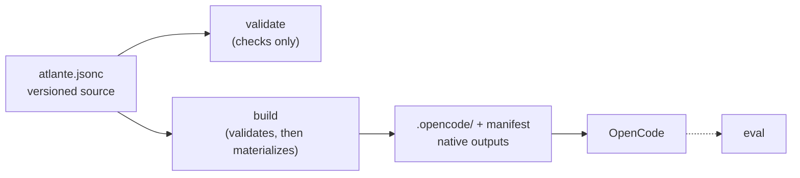

<p align="center">
  
</p>

<p align="center">
  <a href="https://atlante.sh">Website</a> ·
  <a href="https://docs.atlante.sh">Documentation</a> ·
  <a href="https://packs.atlante.sh">Packs</a>
</p>

Atlante gives developers a versioned, structured, and composable source for
their agents and skills. It validates and composes that source, creates the
files their host discovers, and provides `atlante eval` to test the resulting
harness, so it can be developed like code.

> [!NOTE]
> [OpenCode](https://opencode.ai/) is the only supported host today. Read the
> [documentation](https://docs.atlante.sh) for concepts, guides, and reference.

## Quick start

Atlante turns a plain file in your repository into the agents and skills your
coding agent loads. Open the project you want to configure and run:

```bash
npx atlante init
```

`init` writes an `atlante.jsonc` that extends the bundled first-party preset,
builds the native files OpenCode discovers, and registers the read-only Atlante
MCP server. Restart OpenCode and the `atlante` agent is available, with the
default brainstorm, plan, build, and review skills, and `harness` for
maintaining the harness itself.

From here, your harness lives in `atlante.jsonc`. Edit it and rebuild with
`npx atlante build` whenever the configuration changes: validation runs first,
and a failed validation writes nothing.

Packs add reusable agents, skills, and presets shared as npm packages, and
`npx atlante pack install @acme/review-pack` pulls one in. Agents and skills
already written as prose can move into an Atlante configuration with
`npx atlante import agent.md --kind agent --out ./my-pack`. When you want proof
that the harness behaves as intended, `npx atlante eval` runs scenarios in a
sandbox and grades deterministic checks.

> [!NOTE]
> Requires [Node.js](https://nodejs.org) 22 or newer.

The [getting started guide](https://docs.atlante.sh/getting-started) walks
through the first build, and the
[CLI reference](https://docs.atlante.sh/reference/cli) covers every command and
flag.

## How it works

1. **Author** `atlante.jsonc`: extend a preset, bind agents and skills to
   templates, and define values.
2. **Validate** checks the source, selected resources, and template input
   without writing anything.
3. **Build** runs the same validation first, then renders deterministic
   host-native files plus an ownership manifest; nothing is written unless
   validation passes.
4. **Discover**: the host reads the generated agents and skills when it
   starts.
5. **Evaluate** (optional): `atlante eval` runs scenarios in a sandbox and
   grades deterministic checks.



The authored source stays in your repository, so you review and evolve the
harness like any other code. The build materializes deterministic
host-native files; the host executes them.

## Packages

Atlante publishes two packages to npm:

- [`atlante`](https://www.npmjs.com/package/atlante) provides the `init`,
  `import`, `pack`, `validate`, `build`, `mcp`, and `eval` commands.
- [`@atlante/pack`](https://www.npmjs.com/package/@atlante/pack) contains the
  first-party presets, the `agent` and `skill` templates, and their instances.

Published packs are listed in the
[pack explorer](https://packs.atlante.sh/), a curated directory for
inspecting a pack before installing it.

To publish your own reusable content, read
[Author a pack](https://docs.atlante.sh/guides/authoring-packs).

## Documentation

- [Getting started](https://docs.atlante.sh/getting-started)
- Concepts: [Configuration](https://docs.atlante.sh/concepts/configuration), [Resolution](https://docs.atlante.sh/concepts/resolution), [Templates](https://docs.atlante.sh/concepts/templates), [Values](https://docs.atlante.sh/concepts/values), [Resources](https://docs.atlante.sh/concepts/resources), [Evaluation](https://docs.atlante.sh/concepts/evaluation)
- Guides: [Build a harness](https://docs.atlante.sh/guides/building-a-harness), [Evaluate your harness](https://docs.atlante.sh/guides/evaluating-a-harness), [Author a pack](https://docs.atlante.sh/guides/authoring-packs)
- Reference: [MCP](https://docs.atlante.sh/reference/mcp), [CLI](https://docs.atlante.sh/reference/cli), [Eval](https://docs.atlante.sh/reference/eval), [Template syntax](https://docs.atlante.sh/reference/template-syntax), [Schema](https://docs.atlante.sh/reference/schema), [Materialization](https://docs.atlante.sh/reference/materialization), [Diagnostics](https://docs.atlante.sh/reference/diagnostics)
- [Troubleshooting](https://docs.atlante.sh/troubleshooting)

## Community

Join the [Atlante Discord](https://discord.com/invite/W5EcwZvx7) to discuss the
project, ask questions, and share packs.

## Contributing

[CONTRIBUTING.md](CONTRIBUTING.md) describes the contribution process: issue
and pull request templates, the open-a-change cycle, commit and branch
conventions, and test tiers.

## Status

[`SPECIFICATION.md`](SPECIFICATION.md) defines the normative `v0.1` contract.

## License

Atlante is licensed under the MIT License; see [LICENSE](LICENSE). The Atlante
name, logo, and related branding are governed separately by
[TRADEMARKS.md](TRADEMARKS.md).
